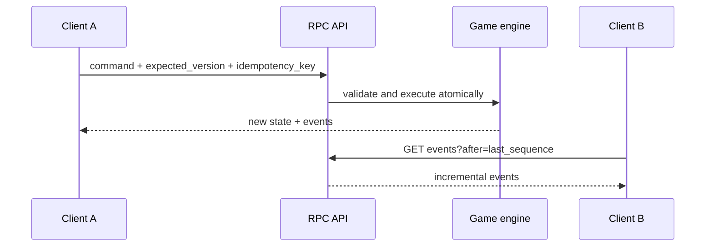
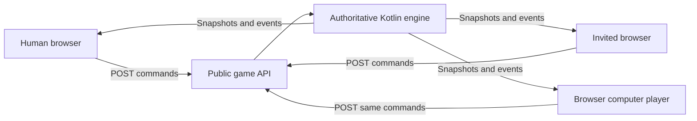

# Architecture

The engine is an authoritative command processor. A client never edits board
state directly: it describes intent, the server validates it, applies it once,
and returns both a fresh snapshot and the events produced by the command.

The included browser app is a reference client, not a privileged UI. Human
moves and its minimax computer opponent both call the same game endpoints. The
client renders only the snapshots returned by the engine and polls for newer
state while an invited opponent is taking a turn.

## Reference client flow

Invite URLs contain only a game UUID. Each browser remembers its own player ID
in session storage. For the beta, the computer uses minimax in the browser but
still acts only through `POST /commands`; it has no access to engine internals.

## Domain model

- `GameState` owns players, status, turn, version, and a board.
- `Board` is a container for spaces, pieces, decks, dice, and arbitrary values.
- `Space` supports graph-style neighbors as well as grid naming.
- `Piece` has a kind, optional owner, location, and extensible attributes.
- `Deck` tracks draw/discard piles and per-player hands of cards.
- `Die` records its number of sides and latest server-generated value.
- `GameEvent` is an ordered fact that clients can consume incrementally.

The service intentionally uses an in-memory repository in this beta, keeping
the rules and transport easy to understand. The service boundary leaves a
clear production path: a database-backed event store, authentication, hidden
player projections, WebSocket/SSE delivery, matchmaking, and pluggable rule
packages can be added without changing the command envelope.

## Correctness properties

- Each game is mutated under a per-engine/per-game lock.
- `expected_version` implements optimistic concurrency control.
- `idempotency_key` prevents duplicate effects on network retries.
- Random card shuffles and dice rolls happen on the server.
- Events and snapshots share one monotonically increasing version sequence.
- Turn ownership, object existence, capacity, and Tic-Tac-Toe rules are checked
  before state is changed.
